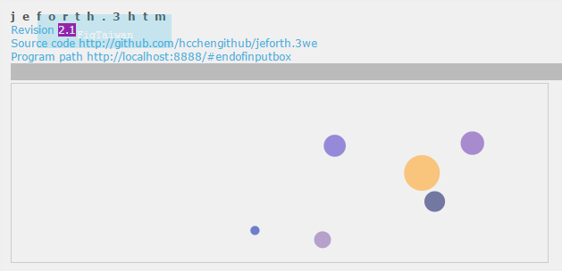
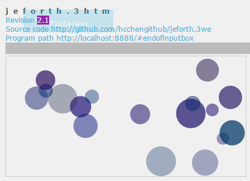
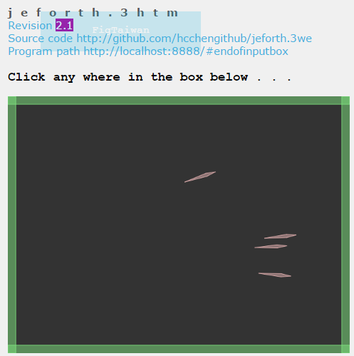
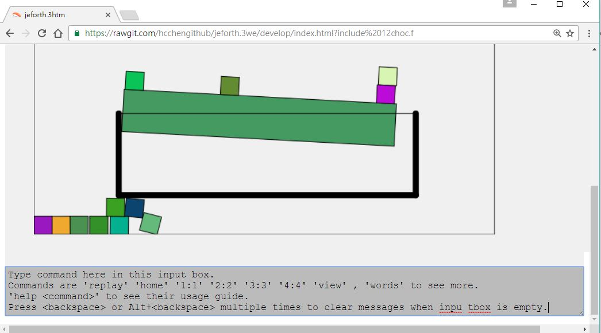
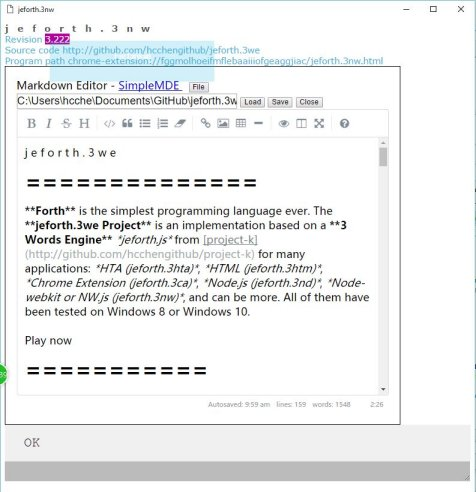
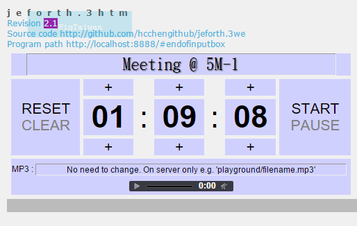
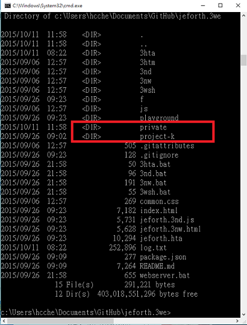
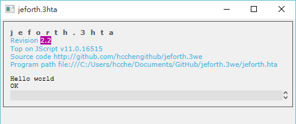
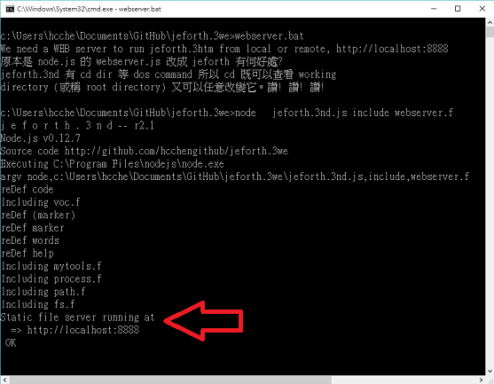

j e f o r t h . 3 w e
==============
**Forth** is the simplest programming language ever. The jeforth.**3we** project is an implementation based on a **3 Words Engine** from [project-k](http://github.com/hcchengithub/project-k) for many applications: Windows HTA (*jeforth.3hta*), HTML (*jeforth.3htm*), Chrome Extension (*jeforth.3ce*), Chrome Application (*jeforth.3ca*), Node.js (*jeforth.3nd*), Node-webkit or NW.js (*jeforth.3nw*), and can be more. All of them have been tested on Windows 8 or Windows 10.

Play now
===========
Among the many applications, jeforth for web page (jeforth.3htm) can run on your web browser right now thus is good for demonstration. 

#### [Solar system](http://hcchengithub.github.io/jeforth.3we?cls_include_solar-system.f)
[簡介](https://www.evernote.com/shard/s22/sh/5066a906-fa5b-4594-9ff8-35fe3d180a14/d1f964de9e7e9b0550911410578482c2)<br>

<br>
#### [H2O](http://hcchengithub.github.io/jeforth.3we?cls_include_h2o.f) 

<br>
#### [Box2Dweb Physics Engine demo - Arrows](http://hcchengithub.github.io/jeforth.3we?cls_include_box2dweb-arrow.f)

<br>
#### [A simulation of the 12 coin problem](http://hcchengithub.github.io/jeforth.3we?cls_include_12choc.f)

<br>
#### [Chipmunk Physics Engine demo - Pyramid Stack](http://hcchengithub.github.io/jeforth.3we?cls_include_chipmunk-js-pyramidstack.f)<br>

<br> 
#### [Markdown editor](https://www.evernote.com/shard/s22/sh/49f2b5ea-5005-4216-a8b8-a3dcc6ea4ad7/e679f4ad541710d02780638622a7e09c)
NW.js can access files in your local computer that allows jeforth.3nw to do things web browsers can't do. For example, [SimpleMDE](https://simplemde.com) is a Markdown Editor that works fine on jeofrth.3nw.<br>

<br>
#### [Alarm clock](http://hcchengithub.github.io/jeforth.3we?cls_include_alarm.f_er)


Get the project
=================

| Item | Address |
----------------|----------------------------------------------
| jeforth.3we high level source code | *http://github.com/hcchengithub/jeforth.3we* |
| Kernel, projectk.js 3-words-engine| *http://github.com/hcchengithub/project-k* |

Get source code from GitHub dwon to your computer through 'git clone' or Download Zip, either way.

Questions and Suggestions
------------------------
Please open "issues" to the project on GitHub. My gmail is hard to work in the recent China.

git clone
---------
'project-k' is a stand alone project and top on it is the 'jeforth.3we' porject. So, we have two projects to 'git clone' from GitHub down to to your computer. 1. 'git clone' jeforth.3we first to a directory named exactly 'jeforth.3we'. 2. Then 'git clone' project-k to under the jeforth.3we directory. 

Download Zip
------------
Click the [Download ZIP] button of both projects [jeforth.3we](https://github.com/hcchengithub/jeforth.3we) and [project-k](https://github.com/hcchengithub/project-k) on their GitHub web page to get them. Unzip jeforth.3we first and then unzip project-k to under the jeforth.3we directory, as shown in the below directory listing. If your unzip'ed directory name is something like "jeforth.3we-master" or "jeforth.3we-develop" then you have to rename it to "jeforth.3we"; do the same thing to "project-k". Then you can run 3hta.bat  without installing anything else if your computer is Windows 8 or Windows 10; or run 3nd.bat and 3nw.bat, if you have installed node.js and nw.js.

My jeforth.3we/ directory listing for example,


<br>
### Note! jeforth.3ha from Donload Zip needs to resolve new line characters from LF to CRLF for Windows  

Only for jeforth.3hta and only when you were **Download Zip** jeforth.3we from GitHub, It's necessary to use GNU tool [unix2dos](http://waterlan.home.xs4all.nl/dos2unix.html) to convert the new line characters of all text files [from Unix's LF to Windows' CRLF](https://en.wikipedia.org/wiki/Unix2dos). The command line is like this:

    d:\jeforth.3we>for /R %G in (*.*) do d:\bin\unix2dos.exe "%G"

If you were **git clone https://github.com/hcchengithub/jeforth.3we** instead of **Download Zip** then forget this step, GitHub shell for Windows converts new line characters to CRLF correctly already. 

Setup
=================
So far only jeforth.3ce and .3ca (Chrome Extension and Chrome Application) need 
their own directory and **Setup.bat** does that for you. All 
other applications can run from jeforth.3we/ directly but it's still nice to 
have their own standalone directory because it's neat and clearer for a new 
comer to understand each applications. 

jeforth.3we/ directory contains everything for all applications. Many files 
are common for all applications. Chrome App and Chrome Extension both require 
a 'manifest.json' file at their home directory, so the jeforth.3we/ root can 
not be their common home. The solution is letting each application to have 
their own directory but share the same jeforth.3we/ root through mirror 
linkages of *symbolic link* and *hard link*. 

At jeforth.3we/ root direcory, you can find the batch program ```setup.bat```.  
It creates application directories: jeforth.3ca/, jeforth.3ce/, 
jeforth.3hta/, jeforth.3nw/, jeforth.3nd/ and jeforth.3htm/ at the same level 
as jeforth.3we/. They are mirrors of subset of jefforth.3we/. It's safe to 
delete them. Run ```setup.bat``` again to rebuild them if any of them were 
not existing. ```setup.bat``` won't rebuild existing directories. **Note!** 
It must be "Run as administrator" due to priviledge commands like 
```mklink.exe``` and ```fsutil.exe``` are utilized. Right click 
```setup.bat``` and select "```Run as administrator```" to run it.

Hello World!
========================
Let's print "Hello World!" on different applications of jeforth.3we

#### **HTA** / jeforth.3hta
Double click the **jeforth.3we/jeforth.hta** (or jeforth.3hta/jeforth.hta) or execute the below DOS command line in a DOS box when currecnt directory is jeforth.3we/ or jeforth.3hta/,
```
jeforth.hta cls .' Hello world' cr 3000 sleep bye
```


The prior method runs self-test because there's no given task to do in command line. The 2'nd method is expected to print 'Hello world' (as shown above) and return to DOS box after 3 seconds.

#### **Node.js** / jeforth.3nd
Make sure you can run node.exe in a DOS box so your Node.js has been setup correctly. Let jeforth.3we/ or jeforth.3nd/ be your working directory. Execute one of the below demo command lines:
```
node jeforth.3nd.js
node jeforth.3nd.js cls .' Hello world' cr bye
```
Again, like the above HTA case, the prior command line does the self-test, and the 2'nd prints 'Hello world'.

#### **HTML** / jeforth.3htm
Having a local Web server is one of the ways to run jeforth.3htm.  We have a local Web server written by jeforth.3nd (Node.js). Run jeforth.3we/Webserver.bat to launch it, 



then try to visit below URLs:
```
http://localhost:8888
http://localhost:8888/index.html
http://localhost:8888/index.html? cr ." hello world" cr cr 
http://localhost:8888/index.html?_cr_."_hello_world"_cr_cr 
```
IE10 , IE11 and Chrome have been tested. As shown above, forth words can be put in the URL after a '?'. jeforth.3htm will run through it like running through a command line and the self-test will be skipped when having a task to do. Space character can be replaced by underscore.

#### **NW.js** / jeforth.3nw
Install your Node.js and Node-Webkit (or NW.js now) in prior. Let jeforth.3we/ (or jeforth.3nw/) be your working directory, run either one of below command lines:
```
nw ../jeforth.3we
nw ../jeforth.3we cls .' Hello World' 3000 sleep bye
```
or below lines if your working directory is jeforth.3nw/ instead of jeforth.3we/
```
nw ../jeforth.3nw
nw ../jeforth.3nw cls .' Hello World' 3000 sleep bye
```

The prior runs self-test because there's no given task to do. The 2'nd prints 'Hello world' and return to DOS prompt after 3 seconds.

#### Chrome Extension / jeforth.3ce
Assume that you have cloned the project to your local computer and have run
`setup.bat` as mentioned above that have created the `jeforth.3ce/` directory then the following steps guide you to install jeforth.3ce Chrome Extension:

1. Type this address `chrome://extensions` to Google Chrome Browser's address line.
2. Turn on the "Developer mode" and see the **LOAD UNPACKED** appears.
3. Click **[LOAD UNPACKED]** and bring the dialog to your `jeforth.3ce/` directory which was
   created by the `setup.bat` mentioned above.
4. Observe the FigTaiwan icon appears on the upper right corner and on the Chrome Extensions
   page amongst other Chrome Extensions.
5. Click the FigTaiwan icon on the upper right corner to launch jeforth.3ce pop-up window. jeforth command line is
   at the bottom of the pop-up window. Click anywhere outside the pop-up window would close it, don't do that yet! Run `open-3ce-tab` to open jeforth.3ce on a normal tab instead of
   the volatiling pop-up window. 
6. Bookmark the jeforth.3ce tab so you can open it anytime a little faster than the above steps.
7. Now play with the following line to download something from the Internet:

    `<o> <h1> Hello World!</h1><a download href="http://example.com"></a></o> :: click() js> 1*60*1000 nap`

    It downloads a web page and then wait for one minute before proseed doing following jobs
    assume that you are downlaoding many many things programmatically. jeforth.3ce can do many other interesting things powered by Chrome Extensions.
8. jeforth.3ce can also be found on the Google **Chrome Web Store** by searching 'jeforth' and installed by clicking the `[+ ADD TO CHROME]` button. But I prefer the above way that uses my local source code that can be modified anytime and takes effect immediately.


#### Chrome Application / jeforth.3ca
Assume that you have cloned the project to your local computer and have run
`setup.bat` as mentioned above that have created the `jeforth.3ca/` directory then the following steps guide you to install jeforth.3ca Chrome Application:

1. Type this address `chrome://extensions` to Google Chrome Browser's address line.
2. Turn on the "Developer mode" and see the **LOAD UNPACKED** appears.
3. Click **[LOAD UNPACKED]** and bring the dialog to your `jeforth.3ca/` directory which was
   created by the `setup.bat` mentioned above.
4. Scroll down the chrome://extensions page if necessary to observe the jeforth.3ca appear in the Chrome Apps section.
5. Type this address `chrome://apps` to Google Chrome Browser's address line, jeforth.3ca should have been created in that page. Click the (FigTaiwan) icon to launch jeforth.3ca on a tab. 
6. Bookmark the jeforth.3ca tab so you can open it anytime a little faster than the above steps.
7. Now play with the following line to download something from the Internet:

    `<o> <h1> Hello World!</h1><a download href="http://example.com"></a></o> :: click() js> 1*60*1000 nap`

    It downloads a web page and then wait for one minute before proseed doing following jobs
    assume that you are downlaoding many many things programmatically. jeforth.3ca is a very handy tool on your Chrome browser.

Applications in every day life
==============================

Demo: Compile the legendary eforth.com
---------------------------------------

Jeforth.3nd for Node.js can be a handy x86 CPU assembler (any other CPU too). We have an example to compile the legendary eforth.com executable for 16 bits PC under MS-DOS by Bill Muench and C. H. Ting, 1990.

 1. Install node.js correctly so you can run node.exe in a DOX box. Working directory at jeforth.3we/ (or jeforth.3nd/). 
 2. Run: node.exe jeforth.3nd.js include 86ef202.f bye
 3. You got jeforth.3we/eforth.com (or jeforth.3nd/eforth.com)
 4. I have a 32bits windows 8, so I can run eforth.com directly. If your Windows system is 64 bits, you'll need a DOS virtual machine like vmware, virtual box, or I recommend DOSBox, to run the created eforth.com.

Demo: Excel automation
---------------------
Use jeforth.3hta to manipulate Microsoft Office Excel spread sheets programmatically. It takes another short page for [Demonstrations of excel automation](https://github.com/hcchengithub/jeforth.3we/wiki/Demonstrations-of-excel-automation).

Please check out the wiki of jeforth.3we repository on GitHub.com for more information. This README has probably been too long already.


Presentation videos
===================

| No.   | Mandarin | English |
--------|----------|---------
| 1  | [Opening](http://www.camdemy.com/media/19253)| n/a |
| 2  | [Run the HTML version online](http://www.camdemy.com/media/19254)| n/a |
| 3  | [Run the HTML version on local computer](http://www.camdemy.com/media/19255)| n/a |
| 4  | [Run the HTA version](http://www.camdemy.com/media/19256)| n/a |
| 5  | [Run Node.js and Node-Webkit version](http://www.camdemy.com/media/19257)| n/a |
| 6  | [F2 inputbox edit mode](http://www.camdemy.com/media/19258)| n/a |
| 7  | [F4 Copy marked string to inputbox](http://www.camdemy.com/media/19259)| n/a |
| 8  | [F5 Restart](http://www.camdemy.com/media/19260)| n/a |
| 9  | [Bigger/Smaller input box](http://www.camdemy.com/media/19261)| n/a |
| 10 | [Esc clear input box](http://www.camdemy.com/media/19262)| n/a |
| 11 | [Tab auto-complete](http://www.camdemy.com/media/19263)| n/a |
| 12 | [Enter jump into the input box](http://www.camdemy.com/media/19264)| n/a |
| 13 | [Up/Down recall command history](http://www.camdemy.com/media/19265)| n/a |
| 14 | [Alt-Up Reuse used commands](http://www.camdemy.com/media/19266)| n/a |
| 15 | [Crtl- / Ctrl+ Zoom in/ Zoom out](http://www.camdemy.com/media/19267)| n/a |
| 16 | [Ctrl-Break stop all tasks](http://www.camdemy.com/media/19268)| n/a |
| 17 | [BackSpace trims the output box](http://www.camdemy.com/media/19269)| n/a |
| 18 | [Help is helpful](http://www.camdemy.com/media/19270)| n/a |
| 19 | [jsc JavaScript Console](http://www.camdemy.com/media/19271)| n/a |

The End
=======
 - FigTaiwan [http://figtaiwan.org](http://figtaiwan.org) 
 - H.C. Chen [hcchen5600@gmail.com](hcchen5600@gmail.com) 2018.6.17
 

